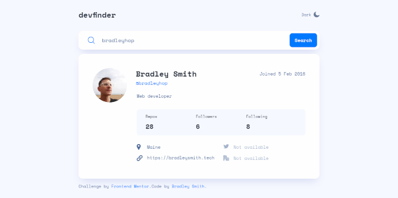

# Frontend Mentor - GitHub user search app solution

This is my solution to the [GitHub user search app challenge on Frontend Mentor](https://www.frontendmentor.io/challenges/github-user-search-app-Q09YOgaH6). Frontend Mentor challenges help you improve your coding skills by building realistic projects. [Live site here.](https://bradleyhop.github.io/frontend-mentor-github-user-search-app/)

## Table of contents

- [Overview](#overview)
  - [The challenge](#the-challenge)
  - [Screenshot](#screenshot)
  - [Links](#links)
- [My process](#my-process)
  - [Built with](#built-with)
  - [What I learned](#what-i-learned)
  - [Continued development](#continued-development)
  - [Useful resources](#useful-resources)
- [Author](#author)

## Overview

### The challenge

Users should be able to:

- View the optimal layout for the app depending on their device's screen size
- See hover states for all interactive elements on the page
- Search for GitHub users by their username
- See relevant user information based on their search
- Switch between light and dark themes
- **Bonus**: Have the correct color scheme chosen for them based on their computer preferences. _Hint_: Research `prefers-color-scheme` in CSS.

  I have met all the user stories listed about along with the bonus challenge
  of checking to see if the user has set a light or dark theme preference and
  setting the app theme appropriately.

### Screenshot

### Links

- Solution URL: [GitHub Repo](https://github.com/bradleyhop/frontend-mentor-github-user-search-app)
- Live Site URL: [Via GitHub Pages](https://bradleyhop.github.io/frontend-mentor-github-user-search-app/)

## My process

### Built with

- Semantic HTML5 markup
- CSS custom properties
- Flexbox
- CSS Grid
- Mobile-first workflow
- [Vue 3](https://vuejs.org/) - JS library
- [Vite](https://vitejs.dev/) - Vite Frontend Tooling
- [SCSS](https://sass-lang.com/) - For styling

### What I learned

- How to change the app theme with a custom attribute and javascript.
- More practice with flexbox and grid; I'm trying to figure out when to use one
  or the other.
- More practice with building an app from a design file (Figma).
- Reading the user's preference for light or dark themes to set the theme of the
    app appropriately.
- I trying to use CSS grid more often to better understand when I would use grid
    vs flexbox; in general, grid is nice for elements of consistant size while
    flex is good for elements differing in size and flowing elements (also good
    for vertically aligning elements within a div vertically).
- One of the more frustrating aspects of this project, and most of the
  interactive projects on Frontend Mentor, is that the user stories are not
  really detailed enough for me. Is there a default profile to be loaded by
  default? In the Figma design file, the pointer icons show interactivity, which
  can be ambiguous in its implementation. However, I can see where this
  ambiguity leaves room for imagination, so I had fun adding little flairs and
  app flow.

### Continued development

### Useful resources

- [Ocktokit and isomorphic-fetch](https://github.com/octokit/octokit.js/issues/2126#issuecomment-1005023857) - The Ocktokit api was given by
  the project outline as a resource to interact with the GitHub user api. To
  use it in my client-side app, I had to install another npm package. This
  thread helped me to determine what I needed and how to implement the
  Ocktokit api.
- [Using custom html attribute and CSS variables to set color theme](https://dev.to/ananyaneogi/create-a-dark-light-mode-switch-with-css-variables-34l8) - I used this article as a launch point in implementing dark and light themes for the app.
- [Serving the static site on GitHub Pages using gh-pages](https://www.npmjs.com/package/gh-pages) - I always forget how to serve the app build from a subtree, so like most
  challenges I find -- there's a npm package for that ;) For my use case, I
  only need to install and save the package, and then add
  `"deploy": "npm run build && gh-pages --dist 'dist' --branch 'release'"`
  under the `"scripts"` object in my package.json file.

## Author

- Website - [Bradley Smith](https://bradleysmith.tech)
- Frontend Mentor -
  [@bradleyhop](https://www.frontendmentor.io/profile/bradleyhop)
